# 📊 GitHub Profile Metrics



## 🎯 À propos

Ce repository utilise [lowlighter/metrics](https://github.com/lowlighter/metrics) pour générer automatiquement des statistiques détaillées de votre profil GitHub. Les métriques sont mises à jour automatiquement et affichent une variété de statistiques sur vos contributions, langages, habitudes de codage, et bien plus encore.

## ✨ Fonctionnalités

### 📈 Métriques principales (`github-metrics.svg`)

- **Header** : Informations de profil de base
- **Activity** : Activité récente et statistiques de contribution
- **Community** : Statistiques communautaires (followers, stars, etc.)
- **Repositories** : Vue d'ensemble de vos repositories

### 🔌 Plugins activés

#### 📅 Isocalendar
Affiche un calendrier annuel de vos contributions GitHub avec des niveaux d'intensité.

#### 💻 Languages
- Analyse approfondie des langages utilisés
- Statistiques détaillées (octets, pourcentage, lignes de code)
- Langages récents et les plus utilisés
- Jusqu'à 8 langages affichés

#### 🕐 Habits (Habitudes de codage)
- Analyse de vos habitudes de commit (heures préférées, jours de la semaine)
- Graphiques détaillés
- Faits intéressants sur votre style de codage
- Analyse sur les 30 derniers jours avec 200+ événements

#### ⭐ Notable Contributions
- Contributions remarquables dans des organisations
- Vue détaillée de vos contributions importantes

#### 💬 Discussions
- Participation aux discussions GitHub
- Catégories de discussions

#### 🏷️ Topics
- Sujets d'intérêt basés sur vos repos étoilés
- Limité aux 15 topics les plus pertinents

#### ⭐ Stars
- Vos 4 repositories étoilés les plus récents

#### 📊 Stargazers
- Graphique de l'évolution des stars sur 30 jours

#### 👥 People
- Vos followers et following
- Jusqu'à 24 personnes affichées

#### 💖 Reactions
- Réactions sur vos issues, PRs et discussions
- Analyse sur 90 jours

#### 📋 Follow-up
- Suivi de vos issues et PRs
- Vue détaillée par repository

#### 📏 Lines of Code
- Statistiques sur les lignes de code
- Top 4 repositories

#### 📈 Traffic
- Statistiques de trafic sur vos repositories

#### 🎯 Activity
- Activité récente détaillée
- 5 dernières activités sur 30 jours

## 🚀 Configuration

### 1. Créer un token GitHub

Pour que les workflows fonctionnent, vous devez créer un Personal Access Token (PAT) :

1. Allez sur [GitHub Settings > Developer settings > Personal access tokens > Tokens (classic)](https://github.com/settings/tokens)
2. Cliquez sur "Generate new token (classic)"
3. Donnez un nom au token (ex: "Metrics Token")
4. Sélectionnez les scopes suivants :
   - ✅ `repo` (Full control of private repositories)
   - ✅ `read:org` (Read org and team membership)
   - ✅ `read:user` (Read ALL user profile data)
   - ✅ `read:packages` (Download packages from GitHub Package Registry)
   - ✅ `read:project` (Read access to projects)
   - ✅ `read:discussion` (Read team discussions)
5. Cliquez sur "Generate token"
6. **Copiez le token immédiatement** (vous ne pourrez plus le voir après)

### 2. Ajouter le token aux secrets du repository

1. Allez dans votre repository > **Settings** > **Secrets and variables** > **Actions**
2. Cliquez sur **"New repository secret"**
3. Nom : `METRICS_TOKEN`
4. Valeur : Collez votre token
5. Cliquez sur **"Add secret"**

### 3. Activer GitHub Actions

1. Allez dans l'onglet **Actions** de votre repository
2. Si c'est la première fois, cliquez sur **"I understand my workflows, go ahead and enable them"**

### 4. Créer votre README de profil (si ce n'est pas déjà fait)

Pour afficher les métriques sur votre profil GitHub :

1. Créez un repository avec le **même nom que votre username** (ex: si votre username est `john`, créez un repo `john`)
2. Ce repository doit être **public**
3. Ajoutez un fichier `README.md` dans ce repository
4. Insérez les images générées :

```markdown
# Bonjour, je suis [Votre Nom] 👋

## 📊 Mes Statistiques GitHub


### 📅 Calendrier de contributions


### 🕐 Habitudes de codage


### 💻 Langages


### 🎯 Activité récente


### ⭐ Contributions remarquables


### 📈 Statistiques des repositories

```

**N'oubliez pas de remplacer `VOTRE_USERNAME` par votre vrai username GitHub !**

## ⚙️ Workflows disponibles

### `metrics.yml` (Principal)
- ✅ S'exécute **toutes les 6 heures**
- ✅ S'exécute sur chaque **push**
- ✅ Peut être lancé **manuellement**
- 📊 Génère `github-metrics.svg` avec toutes les métriques principales

### `metrics-extended.yml` (Étendu)
- ✅ S'exécute **une fois par jour** à minuit
- ✅ Peut être lancé **manuellement**
- 📊 Génère plusieurs fichiers SVG séparés :
  - `github-metrics-extended.svg` - Toutes les métriques combinées
  - `metrics-isocalendar.svg` - Calendrier annuel
  - `metrics-habits.svg` - Habitudes de codage
  - `metrics-languages.svg` - Langages détaillés
  - `metrics-activity.svg` - Activité récente
  - `metrics-notable.svg` - Contributions remarquables
  - `metrics-repositories.svg` - Statistiques des repos

## 🎨 Personnalisation

### Modifier la fréquence de mise à jour

Dans les fichiers `.github/workflows/*.yml`, modifiez la ligne `cron` :

```yaml
schedule:
  - cron: "0 */6 * * *"  # Toutes les 6 heures
  # Exemples :
  # - cron: "0 */12 * * *"  # Toutes les 12 heures
  # - cron: "0 0 * * *"     # Une fois par jour à minuit
  # - cron: "0 0 * * 0"     # Une fois par semaine le dimanche
```

### Changer le fuseau horaire

Modifiez `config_timezone` :

```yaml
config_timezone: Europe/Paris  # France
# Autres exemples :
# config_timezone: America/New_York  # New York
# config_timezone: Asia/Tokyo        # Tokyo
```

### Ajuster les plugins

Vous pouvez activer/désactiver des plugins en changeant `yes` en `no` :

```yaml
plugin_isocalendar: yes   # Activé
plugin_stars: no          # Désactivé
```

### Inclure/exclure des repositories

Pour inclure les repositories privés, assurez-vous que :
1. Votre token a les permissions `repo`
2. Les options suivantes sont configurées :

```yaml
repositories_forks: yes                          # Inclure les forks
repositories_affiliations: owner, collaborator   # Inclure vos repos et ceux où vous collaborez
```

## 🔧 Dépannage

### Les workflows ne s'exécutent pas

1. Vérifiez que GitHub Actions est activé dans les paramètres du repository
2. Vérifiez que le secret `METRICS_TOKEN` est bien configuré
3. Vérifiez que votre token n'a pas expiré
4. Consultez l'onglet **Actions** pour voir les logs d'erreur

### Les images ne s'affichent pas

1. Assurez-vous que les workflows se sont bien exécutés (onglet **Actions**)
2. Vérifiez que les fichiers SVG sont bien présents dans le repository
3. Assurez-vous d'utiliser le bon chemin d'image dans votre README
4. Les images peuvent prendre quelques minutes à se mettre à jour après le commit

### Erreurs de permissions

Si vous voyez des erreurs de type "Resource not accessible by integration" :
1. Vérifiez les permissions du token
2. Assurez-vous d'avoir les scopes nécessaires (voir section Configuration)
3. Vérifiez que le repository a les permissions d'écriture dans Settings > Actions > General

### Optimiser les performances

Si les workflows prennent trop de temps :
1. Réduisez le nombre de plugins actifs
2. Diminuez les limites des plugins (ex: `plugin_activity_limit: 5` → `3`)
3. Réduisez les périodes d'analyse (ex: `plugin_habits_days: 30` → `14`)

## 📚 Documentation

- [lowlighter/metrics](https://github.com/lowlighter/metrics) - Documentation principale
- [Core Plugin](https://github.com/lowlighter/metrics/blob/master/source/plugins/core/README.md) - Options globales
- [Habits Plugin](https://github.com/lowlighter/metrics/blob/master/source/plugins/habits/README.md) - Habitudes de codage
- [Isocalendar Plugin](https://github.com/lowlighter/metrics/blob/master/source/plugins/isocalendar/README.md) - Calendrier
- [Repository Template](https://github.com/lowlighter/metrics/blob/master/source/templates/repository/README.md) - Template repository

## 📝 Licence

Ce projet utilise [lowlighter/metrics](https://github.com/lowlighter/metrics) qui est sous licence MIT.

## 🤝 Contribution

N'hésitez pas à ouvrir une issue ou une PR si vous avez des suggestions d'amélioration !

---

**Note :** Les métriques peuvent prendre quelques minutes à se générer lors de la première exécution. Soyez patient ! 😊

